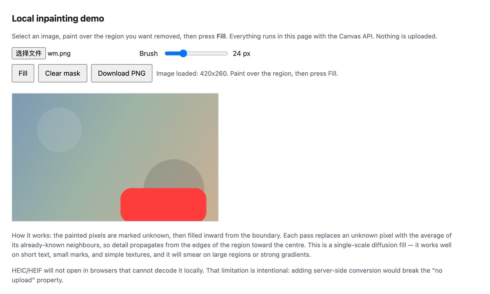
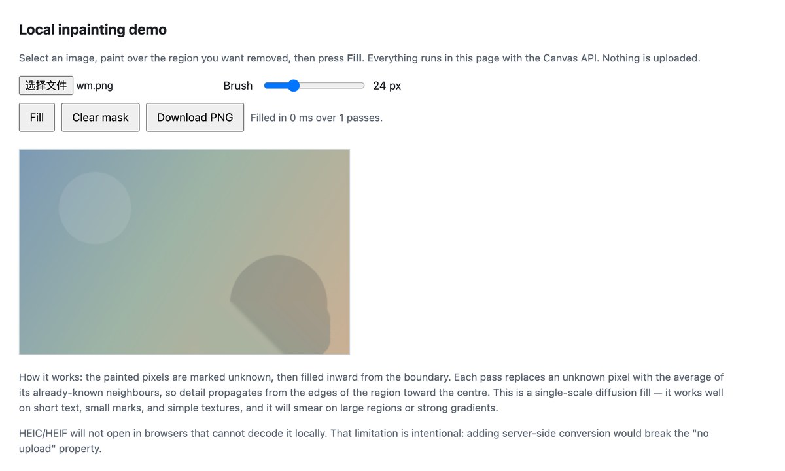

# markvanish-open

Open, reusable material around **browser-local image cleanup** — removing small watermarks, logos, text and date stamps from images **without uploading the image anywhere**.

The live tool lives at **https://markvanish.com/** (free, no account, runs entirely in the browser).

This repository is not the product. It is the reference material behind it: a format-support
table, a privacy checklist for evaluating "local" claims, and a minimal standalone inpainting
demo you can read in one sitting.

*The bundled demo driven end-to-end in Chrome: mark the region, press Fill. On a synthetic
420×260 test image with a 13 px watermark line, the marked area goes from 290 near-white
pixels to 0. The synthetic test image is used so the before/after is reproducible and carries
no third-party rights.*

## What is in here

| Path | What it is |
|:--|:--|
| `data/supported-image-formats.csv` | Input/output format support per page of the live tool, with the canvas size cap of each page and the source recorded for every row |
| `docs/privacy-checklist-local-image-tools.md` | A checklist for verifying that an image tool really processes locally instead of uploading |
| `docs/images/` | Screenshots of the bundled demo (before and after a fill) |
| `tools/local-inpainting-demo.html` | A single-file, dependency-free demo of region-filling from neighbouring pixels using the Canvas API |

## Verifying the local-only claim

The claim "your image never leaves the browser" is only worth as much as the method used to
check it. `docs/privacy-checklist-local-image-tools.md` describes the general method; this is
the result of applying it to this particular product.

Checked on **2026-09-24** against the two scripts the site actually ships:

| Script | Served on | `fetch(` / `XMLHttpRequest` / `FormData` / `sendBeacon` / `WebSocket` / `EventSource` |
|:--|:--|:--|
| `/app.js` | `/` and `/remove-text-from-image/` | none present |
| `/remove-logo-from-image/logo-removal.js` | `/remove-logo-from-image/` | none present |

Neither script references a third-party domain. All pixel work runs through the local decode
and canvas path — `URL.createObjectURL` → `new Image()` → `canvas.getContext('2d')` →
`getImageData` / `putImageData` → `canvas.toBlob()` → local download. There is no upload
primitive anywhere in the shipped code, and no image is posted to a server.

This is a point-in-time check, and the checklist is written so you can repeat it yourself
rather than take this table on faith.

## Two limits that affect the output

Both are features of doing the work locally, and both are worth knowing before you rely on
the result.

**1. Editing canvas size.** Large images are reduced to fit an editing canvas, and the
download is produced from that canvas. The cap differs per page:

| Page | Longest side of the editing canvas |
|:--|:--|
| `/` | 1800 px |
| `/remove-text-from-image/` | 1800 px |
| `/remove-logo-from-image/` | 2400 px |

A 6000 px photo is therefore not returned at 6000 px. If you need the original resolution,
this workflow is not a substitute for a desktop editor.

**2. HEIC and HEIF are device-dependent.** They are listed as accepted inputs, but there is
no bundled WASM decoder — decoding relies on the browser. Safari can open them; browsers that
cannot will fail locally rather than convert on a server. That failure mode is deliberate:
adding server-side conversion would break the "no upload" property.

Disclosure is uneven across the three pages. `/remove-logo-from-image/` states both limits in
its own copy, `/remove-text-from-image/` states the canvas cap but does not flag HEIC, and the
home page states neither — it lists HEIC as a supported input without a caveat. That is the
gap this table exists to close.

## Why local

An image can be personal, confidential, or simply not yours to send to a third party.
If the editing happens in the browser, the site never receives the file. That is the whole
point of this approach, and the checklist in `docs/` is how you verify it rather than take
it on faith.

## Responsible use

Only clean images you own or have permission to edit. Removing a watermark does not grant
any right to the underlying image.

## License

MIT. See `LICENSE`.
